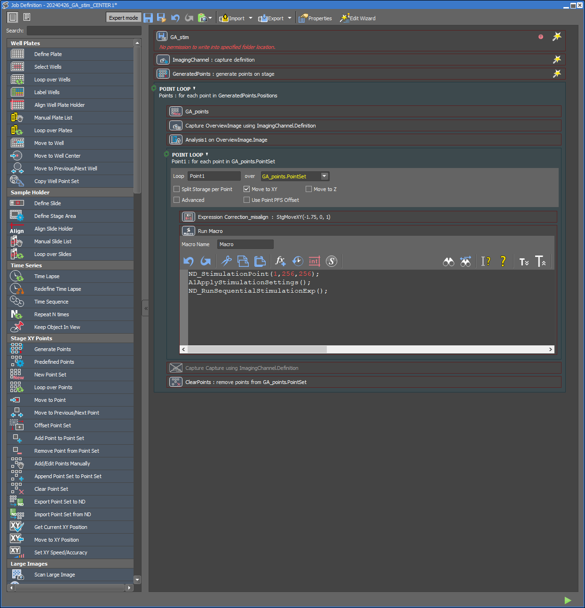
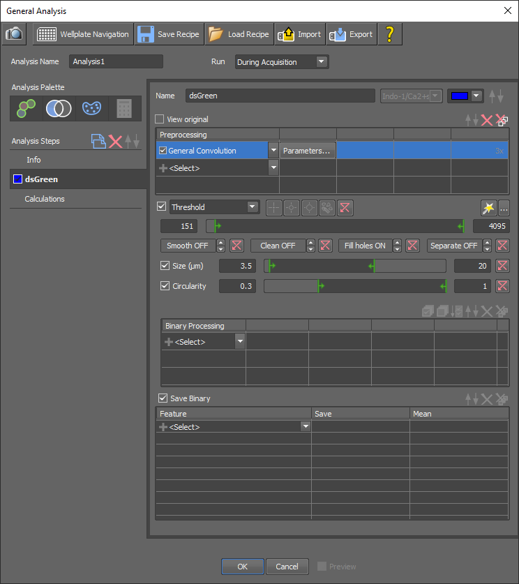

# Detection by intensity thresholding (General Analysis module)

## Goal

Automated image acquisition, analysis by intensity thresholding and stimulation of detected objects. The acquisition, analysis and stimulation are all executed within the NIS-Elements software (Nikon).

## Required file

JOB-GeneralAnalysis-IntensityThresholding.bin

## How to use

1.	Open View > A1R Stimulation and set laser and laser power (e.g. 405 nm, 10% laser power (34 µW)).
2.	Open View > ND Stimulation and set:
Task 1: Stimulation, configuration: A1, time: 300 ms
Task 2: Waiting, time: 10 ms (a stimulation task has to end with an acquisition or waiting step).
3.	Position the stage to the center of the imaging well and focus.
4.	Enable the Perfect Focus System (PFS).
5.	Take a capture of your sample. Select ROI (e.g., Point Stimulation) and test the stimulation by comparing PAmCherry2 fluorescence intensity before and after stimulation.
6.	If it works, close all captures.
7.	Take capture and make sure the ROI is visible and move it a bit (does not matter where).
8.	Click on Apply Stimulation Settings.
9.	Start the JOB. Make sure the Perfect Focus System (PFS) is on, but make sure that no captures are taken outside of the sample area.

Optional: In the JOB, you can enable to take a capture after stimulation, such that you can validate the photoactivation performance. This will lead to a lower throughput. Therefore, you could, for example, run this JOB with a couple of field-of-views (FOVs) to check if everything is working. Hereafter, you start the real experiment.

## User interface

Fig. 1 JOB for liposome detection by intensity thresholding, using a single time frame.
JOB name: JOB-GeneralAnalysis-IntensityThresholding.bin. For each FOV, a capture is taken, which is analysed by the General Analysis module (Analysis1). The resulting points (i.e., coordinates of the detected liposomes) are stored in GA_points. For each point in GA_point, the stage moves to these coordinates. The Correction_misalign expression corrects for a potential misalignment between the intended and actual stimulation point (see Fig. S1 of manuscript). The liposome is stimulated in the center of the FOV.

Fig. 2 General Analysis module within JOB-GeneralAnalysis-IntensityThresholding.bin. The results of the detection are stored in GA_points (this is defined in the Calculations tab).

