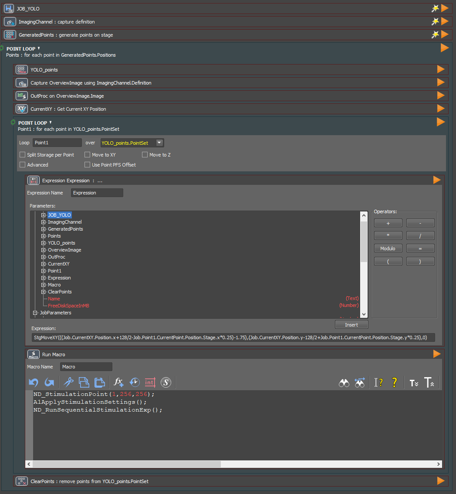
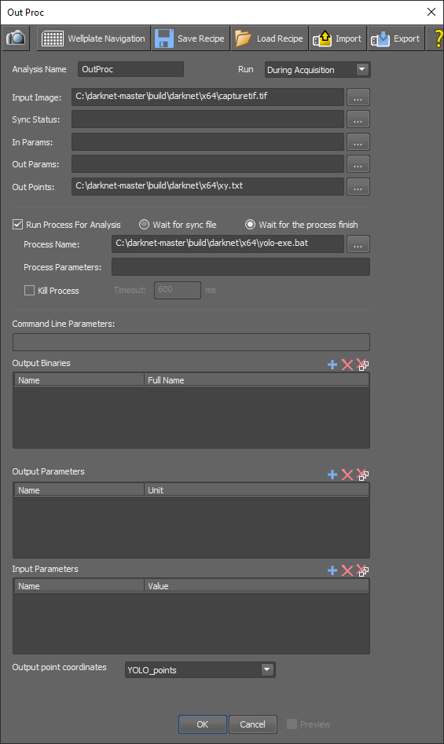

# Photoactivation pipeline with image analysis by object detector YOLO

## Purpose
Automated image acquisition, object detection by YOLO, and stimulation of detected objects. The acquisition and stimulation are initiated by the NIS-Elements software (Nikon), but analysis is triggered by a batch script. Image analysis by the YOLO algorithm could in principle also be exchanged for any other analysis software of choice by adapting the batch script.

## Requirements
**Installation YOLO and ImageMagick** 
_As described [here](https://github.com/DanelonLab/Image-based-Phenotypic-Selection)._

**JOB_YOLO.bin** 
_JOB (NIS-Elements, Nikon) for image acquisition and stimulation. Image analysis is outsourced via the OutProc module._

**yolo-exe.bat** 
_Batch script that is started by NIS-Elements to perform image analysis by YOLO._

**Blue.tif** 
_Black tif image, e.g., 512x512 pixels, 16-bit. Can be created using ImageJ (File > New > Image…). The pipeline is currently configured for two imaging channels. Blue.tif is used as a placeholder to fill the blue channel of the RGB image. When three imaging channels are available, Blue.tif is redundant._

**obj.data**, **obj.names**, **yolov7-tiny_final.weights**, **yolov7-tiny-training.cfg** 
_Requirements for running YOLO._

## Prepare before starting the JOB
1. Copy _yolo-exe.bat_ and _Blue.tif_ to the following direction: C:\darknet-master\build\darknet\x64.
2. Create a folder in the following direction: C:\darknet-master\build\darknet\x64, containing the files for running YOLO (_obj.data, obj.names, yolov7-tiny.cfg_ and _yolov7-tiny_final.weights_, or similar). Adapt the paths in the _obj.data_ and _yolo-exe.bat_ files to this folder (replace _foldername_):
-	In obj.data: `names = foldername/obj.names`
-	In yolo-exe.bat: `darknet_no_gpu.exe detector test foldername/obj.data foldername /yolov7-tiny.cfg foldername/yolov7-tiny_final.weights data/capture.jpg -thresh 0.8 -dont_show -ext_output > output.txt`. Optionally, adjust the -thresh parameter based on the tradeoff between the precision and recall of the trained model.
3. If existing, delete the _count.txt_ file in directory: C:\darknet-master\build\darknet\x64. This file can be retrieved when the JOB has finished to know the total number of stimulations.
4. Create an empty folder named _results-predictions_ in C:\darknet-master\build\darknet\x64 directory. Here, the input and output data of YOLO will be stored for each screened FOV.
5. Optionally, restrictions to the ratio and size of the bounding boxes can be specified in the yolo-exe.bat file (in the part _Set conditions for the width-length-ratio and area of the bounding box_).

## Running the JOB
1.	In NIS-Elements software, open _View_ > _A1R Stimulation_ and set laser and laser power (e.g., 405 nm, 10% laser power).
2.	Open _View_ > _ND Stimulation_ and set:
- Task 1: Stimulation, configuration: A1, time: 300 ms
- Task 2: Waiting, time: 10 ms (a stimulation task has to end with an acquisition or waiting step).
3.	Position the stage to the center of the imaging well and focus.
4.	Enable the Perfect Focus System (PFS).
5.	Take a capture of your sample. Select ROI (e.g., Point Stimulation) and test the stimulation by comparing PAmCherry2 fluorescence intensity before and after stimulation (using the ND Stimulation window).
6.	If it works, close all captures.
7.	Take capture and make sure the ROI is visible and move it a bit (does not matter where).
8.	Click on Apply Stimulation Settings.
9.	Import the JOB (_JOB_YOLO.bin_) in the JOBS Explorer. Specify the path to saving the data, the imaging configuration and the number of field-of-views (FOVs).
10.	Adjust the _Expression_ to correct for difference between the target and observed location of point-stimulation (see Fig. S8 of manuscript). 
`StgMoveXY(x destination coordinate [µm], y destination coordinate [µm], movement type [0=absolute; 1=relative])` 
E.g., `StgMoveXY(((Job.CurrenXY.Position.x+128/2-Job.Point1.CurrentPoint.Position.Stage.x*0.25)-1.75),(Job.CurrentXY.Position.y-128/2+Job.Point1.CurrentPoint.Position.Stage.y*0.25)+0,0)` results in a relative movement of -1.75 µm in x direction and +0 in y direction.
11.	When imaging with an image size other than 512x512 pixels, adjust the Expression (which converts the imported coordinates from pixels to µm) and Macro (the center pixels of the FOV) accordingly.
12.	Start the JOB. Make sure the Perfect Focus System (PFS) is on, but make sure that no captures are taken outside of the sample area.

Optional: By modifying the JOB to take a capture after stimulation, you can validate the photoactivation performance after running the JOB. However, this will increase the time it takes for the JOB to finish. Therefore, it is efficient to first run this JOB with a couple of FOVs to check if accurate photoactivation is successful. Hereafter, you start the experiment with the total number of FOVs.

## Description of the workflow and User interface
For each FOV, a capture is taken and analysed by YOLO. The detected objects are stimulated, whereafter the next FOV is processed.
1.	The OutProc module in the JOB exports the captured image to the C:\darknet-master\build\darknet\x64 directory as _capturetif.tif_ (OutProc only exports tif files). OutProc also starts the batch script (_yolo-exe.bat_).
2.	The batch file:
 - converts _capturetif.tif_ to _capture.jpg_, and stores _capture.jpg_ in C:\darknet-master\build\darknet\x64\data;
 - initiates image analysis by YOLO on _capture.jpg_;
 - stores the raw (_capture.jpg_) and predicted (_predictions.jpg_) images in the _results-predictions_ folder.
3.	The YOLO output coordinates (top left xy coordinate of the bounding box) are converted to center coordinates and stored in the _xy.txt_ file in the _results-predictions_ folder.
4.	The OutProc module in the JOB will wait for _yolo-exe.bat_ to finish, and then import the coordinates from the _xy.txt_ file and store them in a point list.
5.	The JOB will loop over the point list and stimulate each coordinate in the center of the FOV.

**Fig. 1 JOB (_JOB_YOLO.bin_) for automated imaging, analysis by YOLO and photoactivation.**

**Fig 2. OutProc module within _JOB-YOLO.bin_**
