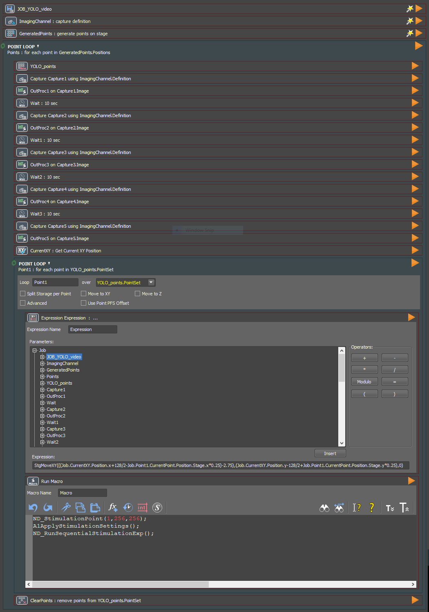
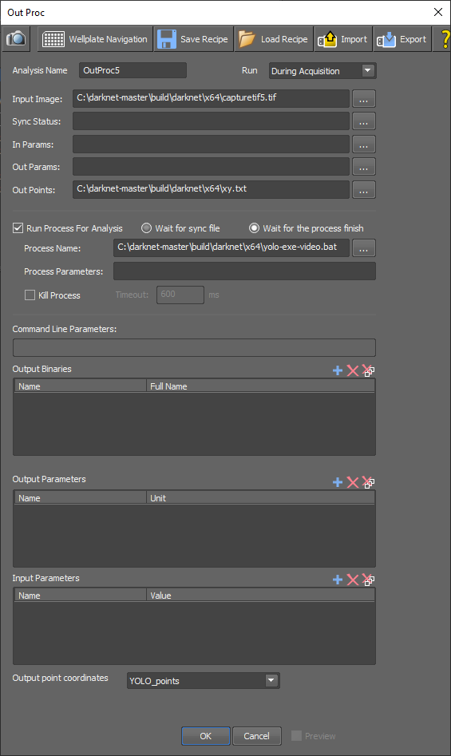

# Photoactivation pipeline for analysis of videos using YOLO

## Purpose
Automated timelapse image acquisition, object detection by YOLO, and photoactivation of detected objects. 

Detected (synthetic) cells are tracked over the time frames. The assigned classes for each detected object are compared over time frames. A change in class over time indicates dynamic behavior, and these objects are photoactivated.

## The workflow is described in [another section](https://github.com/DanelonLab/Image-based-Phenotypic-Selection/tree/main/Detection-By-YOLO-Single-Time-Frame) with the following changes:

### Requirements

**JOB-YOLO-video.bin** instead of JOB-YOLO.bin

**yolo-exe-video.bat** instead of yolo-exe.bat

Additional file: **empty.bat** (file required by the JOB), stored in the following direction: C:\darknet-master\build\darknet\x64

### Running the JOB

1.	In the JOB, define the imaging interval of interest by adjusting the waiting steps between the captures. Define the number of images per FOV by removing or duplicating the _Capture_ and _Wait_ steps.
2.	In the _yolo-exe-video.bat_ file, adjust the 3rd line of code to the number of time frames (e.g., set `NUM_XYFILES=5`). Adjust the class names if relevant in the following line:
`echo %%a | findstr /i /c:"lumen" | findstr /i /c:"membrane" > nul`

### Description of the workflow and User interface

The _yolo-exe-video.bat_ file:
1. computes nearest neighbors between the first time frame and subsequent frames, with a cutoff distance of 20 px (defined in the code as 400 px2).
2. checks whether an object is classified as both _lumen_ (class 1) and _membrane_ (class 2), and if so, extracts its coordinates to a new file.

**Fig. 1 JOB (JOB-YOLO-video.bin) for automated timelapse imaging, analysis by YOLO and photoactivation.**

**Fig. 2 OutProc module for the first time frame.**

**Fig. 3 OutProc module for the last time frame.**
